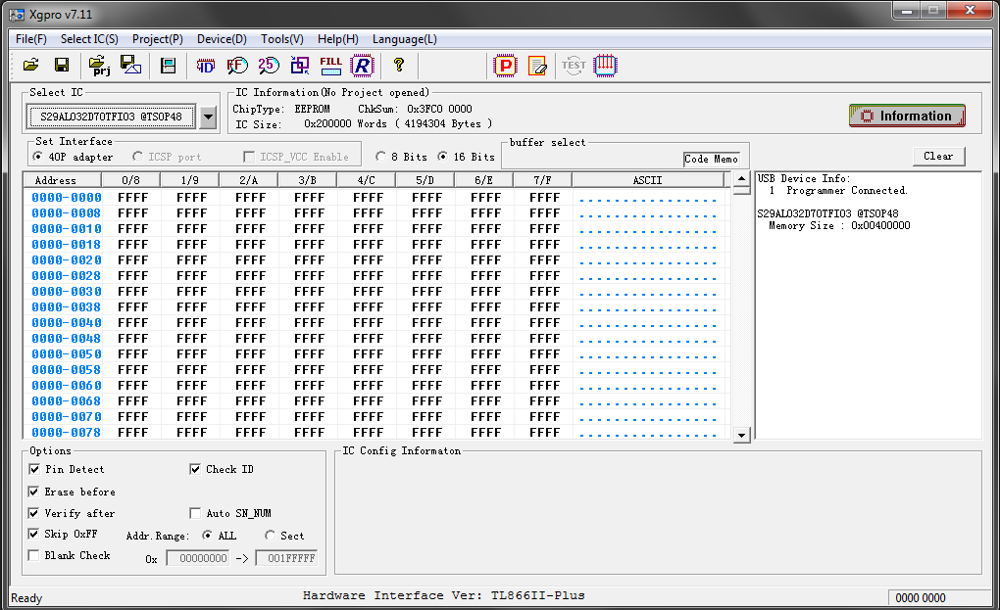

# minipro-gui

A GTK 4 graphical front-end for the [minipro](https://gitlab.com/DavidGriffith/minipro) open-source chip programmer tool, supporting the TL866A/CS, TL866II+, T48, T56, and T76 programmers.



## Features

- **Read / Write / Verify / Erase / Blank Check / Read ID** — full operation support with a real-time progress bar
- **Device browser** — searchable list of all supported chips, filterable by programmer type
- **Hex viewer & editor** — monospace byte grid with inline editing and a diff view comparing read data against a file on disk
- **Device Info** — shows chip parameters (size, VCC, timing, fuse bits) pulled from minipro's XML database
- **Strings** — extracts printable ASCII/UTF-8 strings from the buffer, with minimum-length filtering
- **Entropy** — colour-coded block-by-block Shannon entropy chart to spot compressed, encrypted, or blank regions at a glance
- **Histogram** — byte-frequency bar chart
- **Disassembler** — built-in 6502/65C02 disassembler; falls back to `ndisasm` (NASM) for x86 16/32/64-bit if installed
- **Export** — save the buffer as raw binary, Intel HEX, or Motorola SREC
- **Session memory** — remembers the last device, file path, and operation across restarts

## Requirements

- Python 3.10+
- GTK 4
- PyGObject (`python-gobject`)
- [minipro](https://gitlab.com/DavidGriffith/minipro) installed and on `PATH`
- libusb

Optional: `ndisasm` (from the `nasm` package) for x86 disassembly.

## Installation

### Arch Linux (recommended)

Clone the repo and build the package with `makepkg`:

```bash
git clone --recurse-submodules https://github.com/YOUR_USERNAME/minipro-gui.git
cd minipro-gui
makepkg -si
```

This builds and installs both `minipro` and `minipro-gui` into `/usr`, adds a `.desktop` launcher, udev rules, and bash completion.

After install, plug in your programmer and run:

```bash
minipro-gui
```

Or launch it from your application menu.

### Other Linux distros

Install the dependencies for your distro, then run the script directly:

```bash
# Debian / Ubuntu
sudo apt install python3 python3-gi gir1.2-gtk-4.0 libusb-1.0-0

# Fedora
sudo dnf install python3 python3-gobject gtk4 libusb

# Then clone and run
git clone --recurse-submodules https://github.com/YOUR_USERNAME/minipro-gui.git
cd minipro-gui
python3 minipro_gui.py
```

You will also need to build and install [minipro](https://gitlab.com/DavidGriffith/minipro) itself — follow the instructions in its README.

### udev rules (non-root access)

To use the programmer without `sudo`, install the udev rules:

```bash
sudo cp minipro/udev/60-minipro.rules /etc/udev/rules.d/
sudo udevadm control --reload-rules
sudo udevadm trigger
```

Then add yourself to the `plugdev` group (if your distro uses it):

```bash
sudo usermod -aG plugdev $USER
```

Log out and back in for the group change to take effect.

## Usage

1. Select your **programmer type** from the drop-down (TL866II+, T48, etc.)
2. Click **Browse** to pick a chip from the searchable device list, or type a name directly
3. Choose an **operation** (Read, Write, Verify, Erase, Blank Check, Read ID)
4. For Write/Verify, select a file; for Read, choose where to save
5. Click **Run** — progress is shown in real time
6. Use the tabs to inspect the result: Hex View, Entropy, Histogram, Disassembler, etc.

## License

GPL-3.0 — see [minipro's license](minipro/LICENSE) for the bundled programmer tool.
